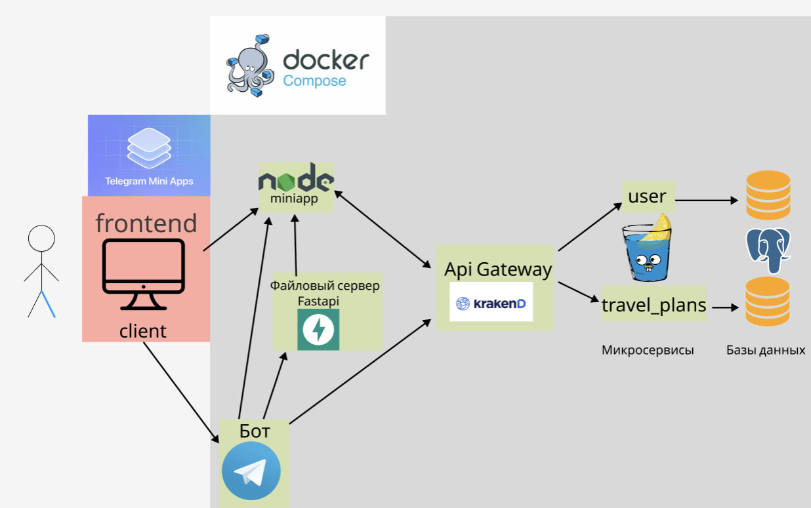

# Как развернуть проект

# Спецификация OpenAPI
Спецификация ручек для взаимодействий внутри сервиса
находится в файле `openapi.yaml`. Можно открыть на сайте https://editor.swagger.io/.

# Требования к системе

## Функциональные требования
1. **Просмотр/создание/редактирование планов:**  
   Пользователи должны иметь возможность создавать новые планы, редактировать существующие и просматривать их.
2. **Поиск тревел планов и возможность пользователей присоединиться к ним**  
   Необходимо реализовать возможность для поиска планов по названию, а также возможность присоединяться к тревел плану.
3. **Фильтрация планов (по тэгам, дате) и сортировка (по названию, дате):**  
   Пользователи смогут фильтровать планы по различным критериям, например, по тэгам, срокам и сортировать по дает и названию.
4. **Авторизация и аутентификация:**  
   Для доступа к функционалу приложения пользователи должны заполнить анкету в тг боте, после чего появляется возможность открыть сам miniapp.

## Нефункциональные требования

1. **Чистая архитектура:**  
   Приложение должно быть разработано с использованием принципов чистой архитектуры, что обеспечит лёгкость в поддержке и масштабировании, а также разделение ответственности.
2. **Безопасность:**  
   Все данные пользователей должны быть защищены, а процесс авторизации должен быть простым, но безопасным (напрямую через тг).
3. **Мобильность:**  
   Интерфейс должен быть адаптирован под различные устройства (мобильные и десктопные версии), чтобы пользователь мог использовать miniapp с любого устройства.
4. **Удобство использования:**  
   Интерфейс приложения должен быть интуитивно понятным, а создание/редактирование тревел планов и навигация по miniapp — удобными для пользователя.

# Архитектура приложения

